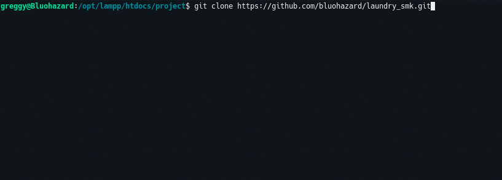

<!-- PROJECT LOGO -->
<br />
<p align="center">
    

  <h3 align="center">Greggy Laundry Online</h3>

> "Greggy Laundry Online" Website Application is a Website that is used to store a lot of information. Information that can be stored is member data, item data, login data, item usage data, purchase data, purchase detail data, transaction detail data, transaction data, laundry type data, employee data, supplier data, and tariff data This application is expected to facilitate the work of Teachers / Admins in conducting data collection.

> This application was created for assignments on the 12th grade "Dynamic Web" subjects.

</p>

<!-- TABLE OF CONTENTS -->
## Table of Contents

* [About the Project](#about-the-project)
* [Built With](#built-with)
* [Installation](#installation)
* [License](#license)
* [Contact](#contact)

<!-- ABOUT THE PROJECT -->
## About The Project

### Login Page


### Main Page


### Example Form Page


## Built With
* [PHP](https://www.php.net/)
* [MySQL](https://www.mysql.com/)

## Installation

1. Clone the repo
```sh
git clone https://github.com/bluohazard/laundry_smk.git
```
<p align="center">
  
</p>

2. Import Database `attachment/database/jasa_laundry.sql` to your PhpMyAdmin

3. Edit file `config/koneksi.php` adjust to your database connection. Example : 
```
$host = "localhost";    // MySQL host Url
$user = "root";         // MySQL user
$password = "";         // MySQL password
$database = "jasa_laundry";  // database name
```

<!-- LICENSE -->
## License

Distributed under the MIT License. See `LICENSE` for more information.

<!-- CONTACT -->
## Contact

Greggy Gianini Firmansyah - [@greggygf](https://instagram.com/GreggyGF) - greggygf@gmail.com